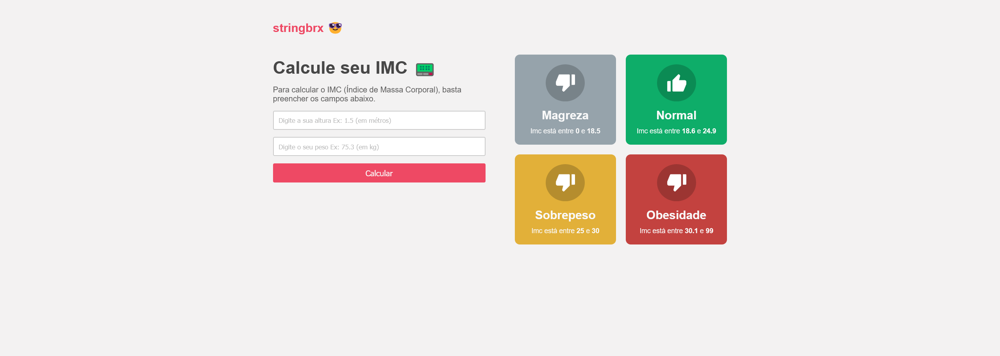

<h1 align=" center"> 
    Calculadora de IMC (react.js) 📟
</h1>

<h1>
    
</h1>

<h2>🚨 Sobre </h2>

Projeto basico feito com react, desenvolvendo uma calculadora de  Indice de massa corporal (IMC).

<h2>🔨 Ferramentas </h2>

- React JS

### Instalação
- `npm install`

### Para rodar o projeto
- `npm run start`